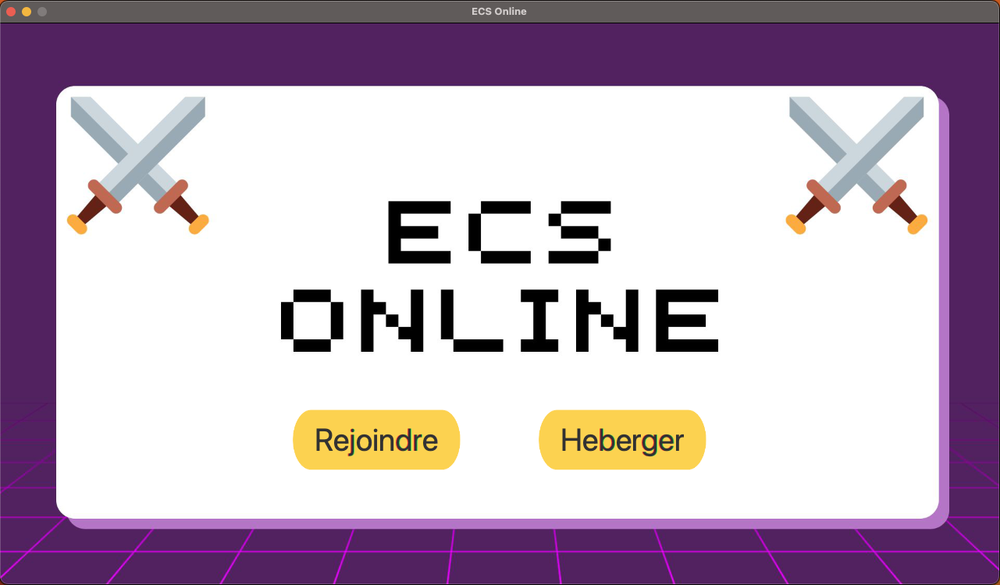
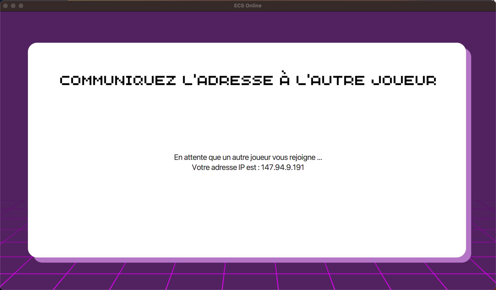
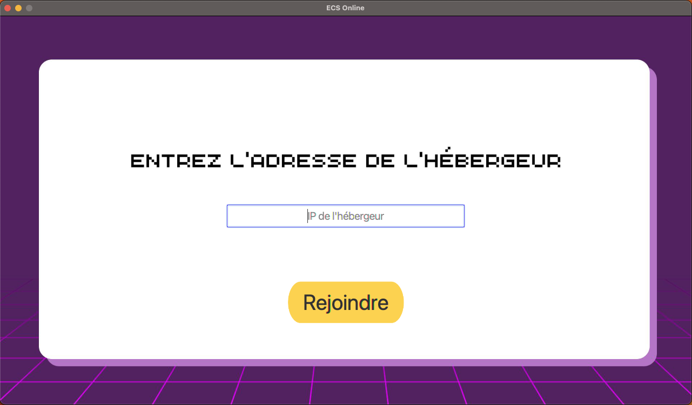
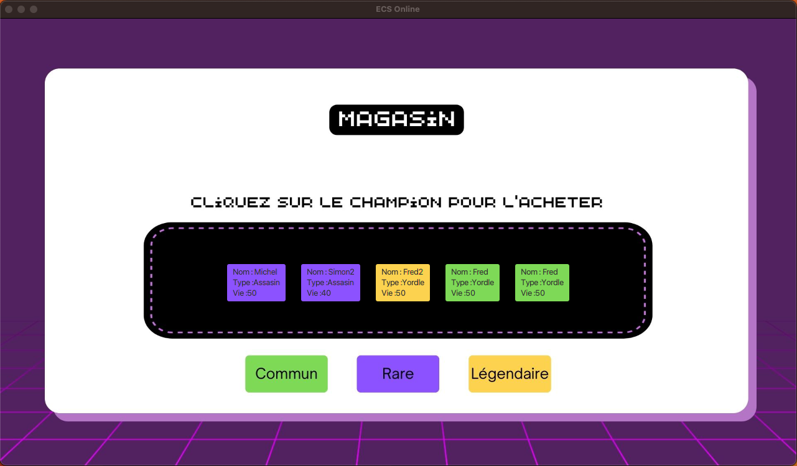
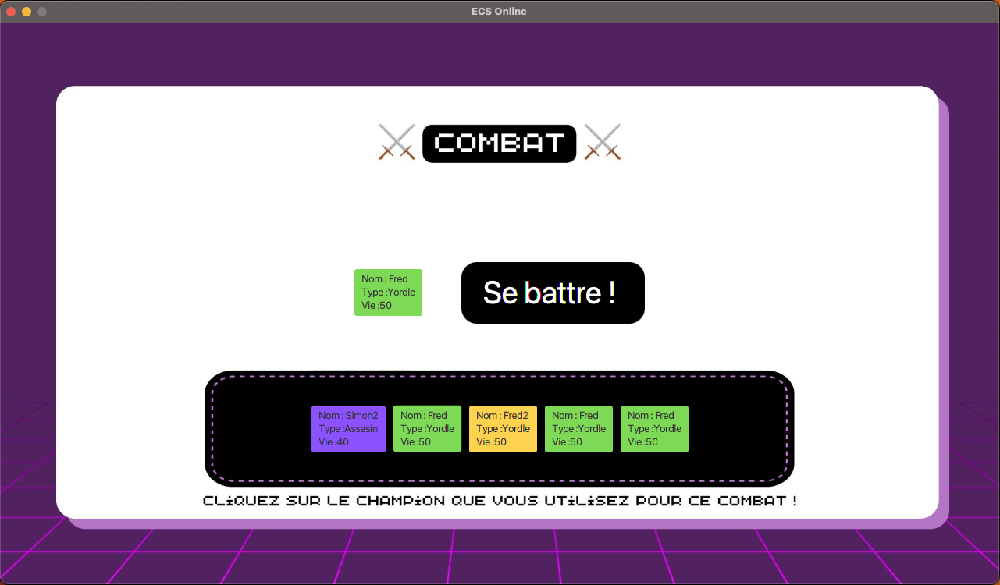
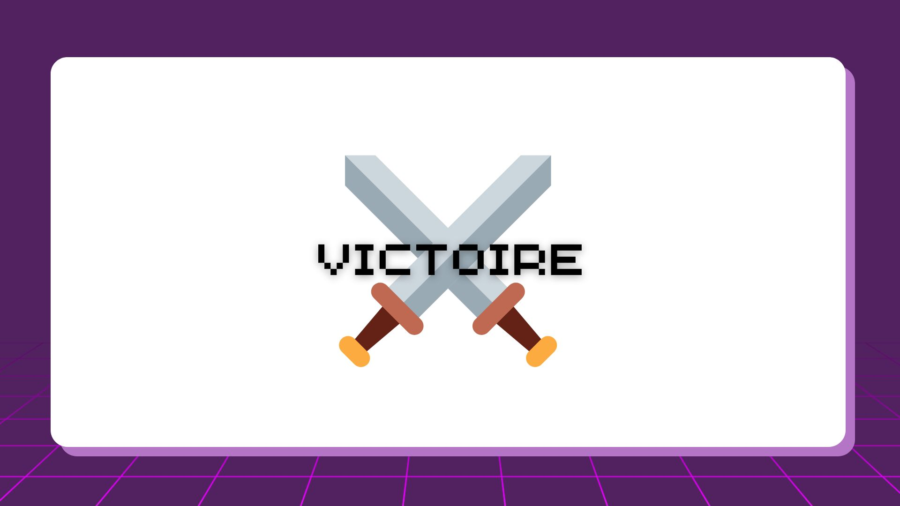

# ECS Online

[](https://forthebadge.com)

ECS Online est un jeu en ligne qui se joue à deux joueurs. Il vous permet de vous affronter avec un adversaire présent sur votre réseau local. Dans ce jeu, vous aurez l'occasion de découvrir différentes entités au fil de vos parties. Le jeu est divertissant et offre une expérience de jeu en ligne amusante et passionnante. Vous pourrez affronter votre adversaire en utilisant différentes stratégies pour remporter la victoire. Si vous aimez les jeux en ligne à deux joueurs, ECS Online est un excellent choix. Le jeu est simple à jouer et offre une interface intuitive pour une expérience de jeu fluide et agréable. Vous pourrez vous divertir pendant des heures en affrontant votre adversaire dans des parties passionnantes. Alors n'hésitez plus et essayez ECS Online dès maintenant !

## Fonctionnalités ⚙️

- La possibilité d'héberger une partie
- La possibilité de rejoindre une partie
- Un magasin avec des taux d'apparition afin de choisir ses combattants
- Une partie combat intéractive

## Démarrage 🚀

Pour lancer l'application via un IDE ouvrez simplement le fichier LaunchApp.java, et exécuter cette ligne :
```java
public class LaunchApp extends Application {
```
Application fonctionnelle sur : 


Vous pouvez aussi la lancer en exécutant le fichier ECSOnline.jar téléchargeable en cliquant sur le bouton ci-dessous.

[](https://google.fr")

Pour exécuter le fichier ECSOnline.jar, vous pouvez soit cliquer à deux reprises dessus soit entrer la commande suivante dans votre terminal à l'endroit où se situe le fichier :
```bash
java -jar ECSOnline.jar
```
## Utilisation 🎮

- Accueil

Sur cette page, vous pouvez choisir d'être l'hôte de la partie en cliquant sur "Heberger" ou le client en cliquant sur "Rejoindre".



- Héberger

L'un des deux joueurs doit héberger la partie, et l'autre la rejoindre. Celui qui aura cliqué sur "Heberger" arrivera sur cette page où il attends la connection de son adversaire. Il faut qu'il lui communique son adresse ip pour qu'il se connecte.



- Rejoindre

Si vous avez cliqué sur rejoindre à l'étape précédente, vous arriverez sur cette page. Il faut insérer l'adresse ip de l'hébergeur pour se connecter.



- Magasin

Une fois la connexion établie, les joueurs doivent chosir leurs combattants. Ils ont plusieurs niveaux de rareté comme "Légendaire", "Rare", "Commun". Ces niveaux déterminent les compétences des entités. Plus les entitées sont rares, moins elles apparraissent. Un joueur doit choisir 5 entités qui seront utilisés pour le combat avec son adversaire.



- Combat

C'est maintenant que le combat commence. Le combat se termine lorsque l'un des deux joueurs n'as plus d'entitées dans son deck. À chaque tour, il faut choisir un champion qui sera celui qui se bat et ensuite cliquer sur le bouton "Se battre !".



- Victoire

Une fois la partie terminée, le gagnant a un écran de victoire.



## Membres du projet 🧑‍💻

Ceccarelli Luca</br>
Egenscheviller Frédéric</br>
Saadi Nils
