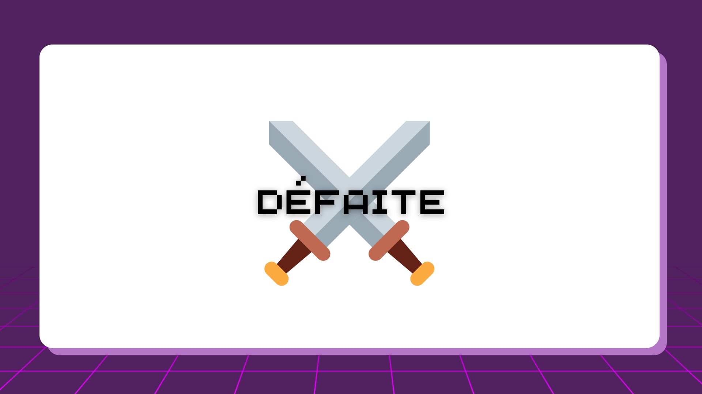
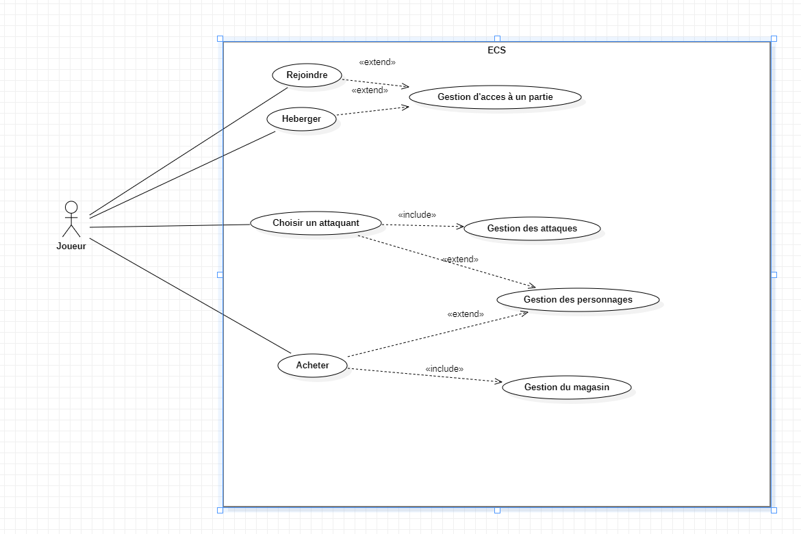

# ECS Online

[](https://forthebadge.com)

ECS Online est un jeu en ligne qui se joue à deux joueurs. Il vous permet de vous affronter avec un adversaire présent sur votre réseau local. Dans ce jeu, vous aurez l'occasion de découvrir différentes entités au fil de vos parties. Le jeu est divertissant et offre une expérience de jeu en ligne amusante et passionnante. Vous pourrez affronter votre adversaire en utilisant différentes stratégies pour remporter la victoire. Si vous aimez les jeux en ligne à deux joueurs, ECS Online est un excellent choix. Le jeu est simple à jouer et offre une interface intuitive pour une expérience de jeu fluide et agréable. Vous pourrez vous divertir pendant des heures en affrontant votre adversaire dans des parties passionnantes. Alors n'hésitez plus et essayez ECS Online dès maintenant !

## Fonctionnalités ⚙️

- La possibilité d'héberger une partie
- La possibilité de rejoindre une partie
- Un magasin avec des taux d'apparition afin de choisir ses combattants
- Une partie combat intéractive

## Démarrage 🚀

Application fonctionnelle sur : 


Pour lancer l'application via un IDE ouvrez simplement le fichier LaunchApp.java, et exécuter cette ligne :
```java
public class LaunchApp extends Application {
```

Vous pouvez aussi la lancer en exécutant le fichier jar.

Pour exécuter le fichier jar, vous pouvez soit cliquer à deux reprises dessus soit entrer la commande suivante dans votre terminal à l'endroit où se situe le fichier :
```bash
java -jar nomFichier.jar
```
## Utilisation 🎮

- Accueil

Sur cette page, vous pouvez choisir d'être l'hôte de la partie en cliquant sur "Heberger" ou le client en cliquant sur "Rejoindre".


- Héberger

L'un des deux joueurs doit héberger la partie, et l'autre la rejoindre. Celui qui aura cliqué sur "Heberger" arrivera sur cette page où il attends la connection de son adversaire. Il faut qu'il lui communique son adresse ip pour qu'il se connecte.


- Rejoindre

Si vous avez cliqué sur rejoindre à l'étape précédente, vous arriverez sur cette page. Il faut insérer l'adresse ip de l'hébergeur pour se connecter.


- Magasin

Une fois la connexion établie, les joueurs doivent chosir leurs combattants. Ils ont plusieurs niveaux de rareté comme "Légendaire", "Rare", "Commun". Ces niveaux déterminent les compétences des entités. Plus les entitées sont rares, moins elles apparraissent. Un joueur doit choisir 5 entités qui seront utilisés pour le combat avec son adversaire.


- Combat

C'est maintenant que le combat commence. Le combat se termine lorsque l'un des deux joueurs n'as plus d'entitées dans son deck. À chaque tour, il faut choisir un champion qui sera celui qui se bat et ensuite cliquer sur le bouton "Se battre !".


- Victoire

Une fois la partie terminée, le gagnant a un écran de victoire.


Le perdant a un écran de défaite.



## Besoins fonctionnels/non-fonctionnels
### Besoins fonctionnels
- En tant que client, je veux que l'application utilise des classes abstraites pour répondre à mes exigences techniques.

- En tant que client, je veux que l'application utilise des interfaces pour répondre à mes exigences techniques.

- En tant que client, je veux que l'application utilise des itérateurs pour répondre à mes exigences techniques.

- En tant que client, je veux que l'application utilise des collections pour répondre à mes exigences techniques.

- En tant que client, je veux que l'application utilise des exceptions pour répondre à mes exigences techniques.

- En tant que client, je veux que l'application utilise des threads pour répondre à mes exigences techniques.

- En tant que client, je veux que l'application utilise de la généricité pour répondre à mes exigences techniques.

### Besoins non-fonctionnels

- En tant que joueur, je veux héberger une partie pour jouer avec mes amis.

- En tant que joueur, je veux rejoindre une partie pour rejoindre mes amis.

- En tant que joueur, je veux acheter des personnages pour construire mon équipe.

- En tant que joueur, je veux choisir un personnage pour attaquer mon adversaire.

- En tant que joueur, je veux avoir une interface pour les personnages afin de jouer plus facilement.

- En tant que joueur, je veux avoir des personnages de différents types pour avoir de la diversité dans mon équipe.

- En tant que joueur, je veux que les personnages aient des stats différentes pour que certains soient plus forts que d'autres.

- En tant que joueur, je veux que les personnages aient des raretés différentes pour que les personnages aient des taux de drop différents.

- En tant que joueur, je veux un magasin aléatoire pour que chaque partie soit différente.

- En tant que joueur débutant, je veux une légende pour la rareté afin de savoir ce qui est le plus rare.

### Diagramme de cas d'utilisation



### Écart avec les prévisions

Au départ, nous étions partis sur l'idée de faire un jeu avec intéraction via le terminal. Finalement, nous avons décidé de faire un jeu avec interface graphique afin de le rendre plus interractif. De plus, nous l'avons rendu multijoueur et jouable en LAN pour pouvoir jouer à deux. Un ordinateur fait office de serveur, et l'autre de client.

### Mesures d'amélioration

Pour améliorer notre projet, nous aurions pu créer une classe qui gère toute la partie aléatoire de l'application. Ceci nous aurait permis de la rendre plus testable/propre.

### Diagrammes de classes

L'un réalisé sur mermaid.

```mermaid
classDiagram
direction BT
class ApprovisionnementMagasin {
  + ApprovisionnementMagasin() 
  + ajouterALaListeDesChampionsExistants(Entite) void
  - choisisEntiteAleatoirementParmisListe(Paquet) Entite
  + trieRarete() void
  + raffrechirEntitesDansMagasin() Paquet
   Paquet listeCommun
   Paquet listeLegendaire
   Paquet listeRare
}
class Assassin {
  + Assassin(String, int, int, int, Rarete) 
  + toString() String
   int maxAtt
   int maxVie
   String type
   int minAtt
   int minDef
   int maxDef
}
class BoutonChampion {
  + BoutonChampion(Entite, int) 
  + BoutonChampion() 
  - initBouton() void
   int indiceBouton
   Entite entite
}
class Client {
  + Client(String, int) 
  + connexion() void
}
class Combat {
  + Combat(Joueur) 
  - initBoutonCombat() void
  + verifieSiTousLesChampionsSontMorts() boolean
  + afficherDegats() void
  - initId() void
  + combat() void
  - initBoutonsChampions() void
  + asGagne() void
  + verifieSiChampionVivant() void
   BoutonChampion boutonChampionChoisiAuCombat
}
class CombatClient {
  + CombatClient(Joueur) 
  + combat() void
  + asPerdu() void
}
class CombatServeur {
  + CombatServeur(Joueur) 
  + asPerdu() void
  + combat() void
}
class Combattant {
  + Combattant(String, int, int, int, Rarete) 
  + toString() String
   int maxAtt
   int maxVie
   String type
   int minDef
   int maxDef
}
class Entite {
  + Entite(String, int, int, int, Rarete) 
  + toString() String
  + attaquer(Entite) void
   int maxVie
   int minVie
   String type
   int pointsDefense
   int maxDef
   int pointsVie
   int maxAtt
   String nom
   int minAtt
   Rarete rarete
   int pointsAttaque
   int minDef
}
class Erudit {
  + Erudit(String, int, int, int, Rarete) 
  + toString() String
   int maxAtt
   int maxVie
   String type
   int minDef
   int maxDef
}
class FenetreMagasin {
  + FenetreMagasin() 
  - chargerBoutonsAchatChampions() void
  - initBoutonsChampions() void
  + diminuerNbAchats() void
  - verifierTaillePaquet() void
  + initElements() void
}
class FinPartie {
  + FinPartie(boolean) 
  + choixArrierePlan(boolean) void
}
class FonctionAleatoire {
  + FonctionAleatoire() 
}
class Heberger {
  + Heberger() 
  - initialisationBoutons() void
  + initialisationTexteEtIp() void
  + recupererIpLocale() InetAddress
   Serveur serveur
}
class InitListeChampionsExistants {
  + InitListeChampionsExistants() 
  + InitListe() void
}
class Joueur {
  + Joueur(String) 
  + toString() String
  + ajouterAuPaquet(Entite) void
   Paquet paquet
}
class LancerApp {
  + LancerApp() 
  + start(Stage) void
  + main(String[]) void
  - initialisationBoutons() void
}
class Magasin {
  + Magasin() 
  + achat(String) Entite
  + initMagasin() void
   ArrayList~Entite~ magasin
}
class Mage {
  + Mage(String, int, int, int, Rarete) 
  + toString() String
   int maxAtt
   int maxVie
   String type
   int minDef
   int maxDef
}
class NomEntiteNonPresentDansMagasinException {
  + NomEntiteNonPresentDansMagasinException(String) 
}
class NotifierConnexion {
  + NotifierConnexion(Scene) 
  + mettreAJour(Observable) void
}
class Observable {
<<Interface>>
  + effacerObserver(Observer) void
  + notifierObserver() void
  + ajoutObserver(Observer) void
}
class Observer {
<<Interface>>
  + mettreAJour(Observable) void
}
class Paquet {
  + Paquet() 
  + Paquet(int) 
  + toString() String
  + trierParPv() void
}
class Partie {
  + Partie() 
}
class Rarete {
<<enumeration>>
  + Rarete() 
  + valueOf(String) Rarete
  + values() Rarete[]
}
class Rejoindre {
  + Rejoindre() 
  + initialisationsElements() void
  - initialisationBoutons() void
   Client client
}
class Serveur {
  + Serveur(int) 
  + effacerObserver(Observer) void
  + notifierObserver() void
  + connexion() void
  + ajoutObserver(Observer) void
}
class SocketEchange {
  + SocketEchange(int) 
  + envoyer(Entite) void
  + estEntitesRecuesVide() boolean
  + ecouter() void
  + connexion() void
  + deconnexion() void
   Entite bufferRecu
}
class ValeursPersonnagesInvalides {
  + ValeursPersonnagesInvalides(String) 
  + pointsVieNonValides(int, int, int) ValeursPersonnagesInvalides
  + pointsDefenseNonValides(int, int, int) ValeursPersonnagesInvalides
  + pointsAttaqueNonValides(int, int, int) ValeursPersonnagesInvalides
}
class Yordle {
  + Yordle(String, int, int, int, Rarete) 
  + toString() String
   int maxAtt
   int maxVie
   String type
   int maxDef
}

ApprovisionnementMagasin  ..>  Paquet : «create»
ApprovisionnementMagasin "1" *--> "listeChampionsExistants 1" Paquet 
Assassin  -->  Entite 
BoutonChampion "1" *--> "entite 1" Entite 
Client  -->  SocketEchange 
Combat "1" *--> "boutonsChampions *" BoutonChampion 
Combat  ..>  BoutonChampion : «create»
Combat  ..>  FinPartie : «create»
Combat "1" *--> "joueur 1" Joueur 
CombatClient "1" *--> "client 1" Client 
CombatClient  -->  Combat 
CombatClient  ..>  FinPartie : «create»
CombatServeur  -->  Combat 
CombatServeur  ..>  FinPartie : «create»
CombatServeur "1" *--> "serveur 1" Serveur 
Combattant  -->  Entite 
Entite "1" *--> "rarete 1" Rarete 
Erudit  -->  Entite 
FenetreMagasin "1" *--> "boutonsChampions *" BoutonChampion 
FenetreMagasin  ..>  BoutonChampion : «create»
FenetreMagasin  ..>  CombatClient : «create»
FenetreMagasin  ..>  CombatServeur : «create»
FenetreMagasin "1" *--> "joueur 1" Joueur 
FenetreMagasin  ..>  Joueur : «create»
FenetreMagasin  ..>  Magasin : «create»
FenetreMagasin "1" *--> "magasin 1" Magasin 
Heberger  ..>  NotifierConnexion : «create»
Heberger  ..>  Serveur : «create»
Heberger "1" *--> "serveur 1" Serveur 
InitListeChampionsExistants  ..>  Assassin : «create»
InitListeChampionsExistants  ..>  Combattant : «create»
InitListeChampionsExistants  ..>  Erudit : «create»
InitListeChampionsExistants  ..>  Mage : «create»
InitListeChampionsExistants  ..>  Yordle : «create»
Joueur "1" *--> "paquet 1" Paquet 
Joueur  ..>  Paquet : «create»
LancerApp  ..>  Heberger : «create»
LancerApp  ..>  Rejoindre : «create»
Magasin  ..>  NomEntiteNonPresentDansMagasinException : «create»
Magasin "1" *--> "magasin 1" Paquet 
Magasin  ..>  Paquet : «create»
Mage  -->  Entite 
NotifierConnexion  ..>  FenetreMagasin : «create»
NotifierConnexion  ..>  Observer 
Rejoindre  ..>  Client : «create»
Rejoindre "1" *--> "client 1" Client 
Rejoindre  ..>  FenetreMagasin : «create»
Serveur  ..>  Observable 
Serveur "1" *--> "observers *" Observer 
Serveur  -->  SocketEchange 
SocketEchange  ..>  Paquet : «create»
SocketEchange "1" *--> "entitesRecues 1" Paquet 
Yordle  -->  Entite 
```


L'autre réalisé avec IntelliJ IDEA.


## Membres du projet 🧑‍💻

Ceccarelli Luca</br>
Egenscheviller Frédéric</br>
Saadi Nils
